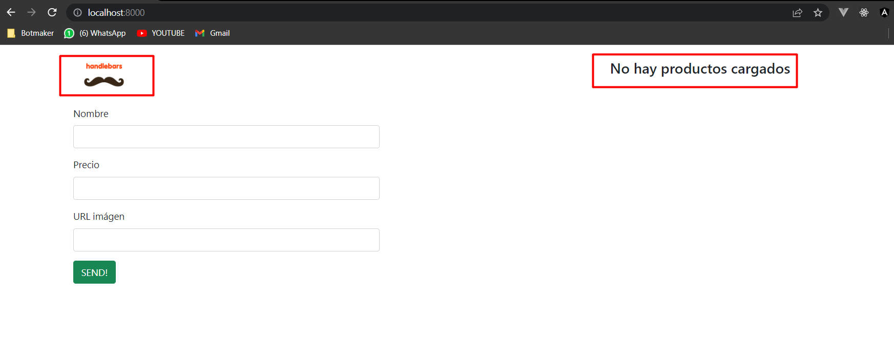
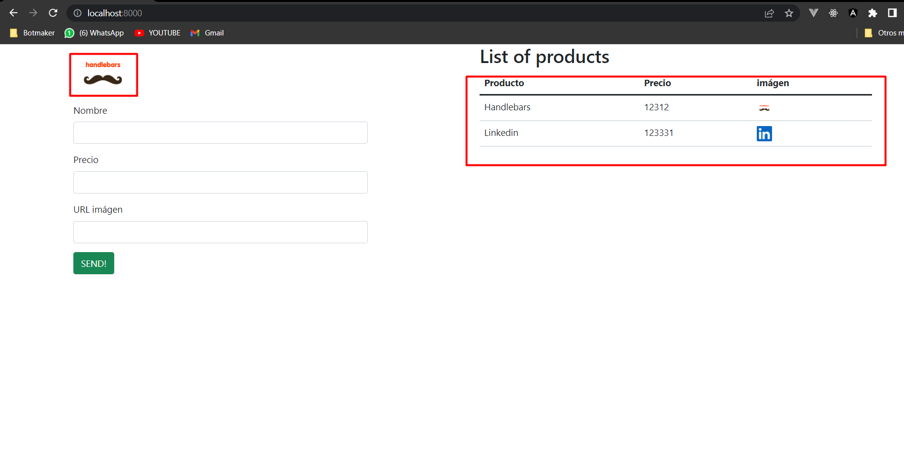
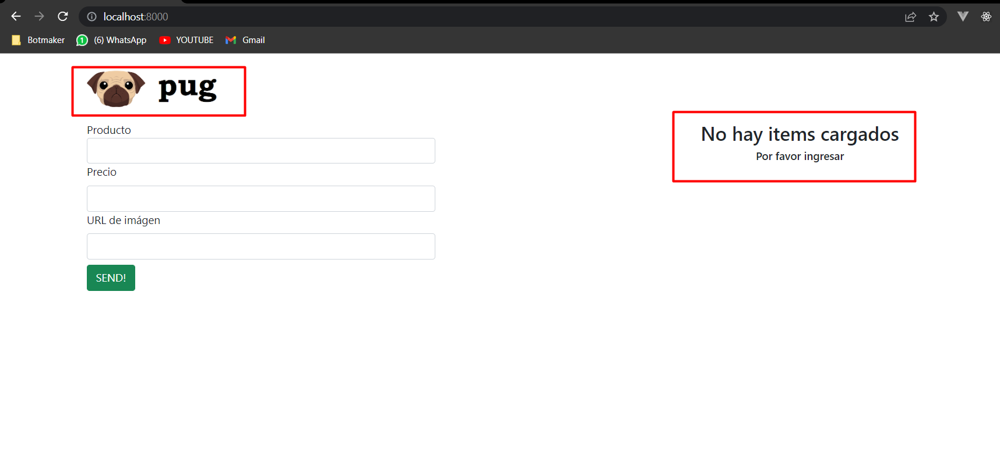
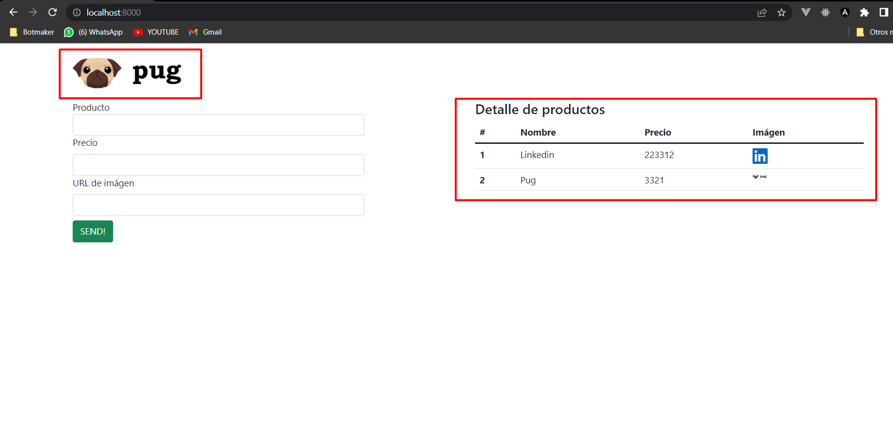
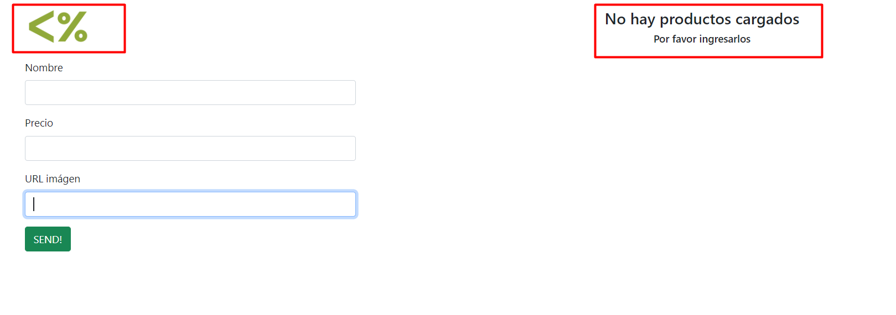
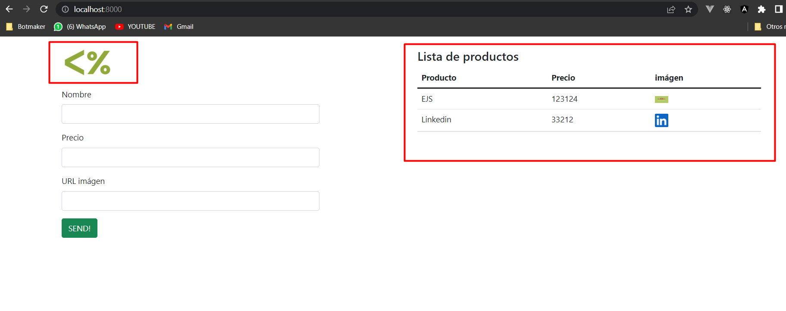

## Template Engines Class N°5

**Instalar dependecias**

```
 npm i
```

**Inicializar servidor**

```
 npm start
```

**Inicializar servidor como dev**

```
 npm run dev
```

### Evidencia de plantillas:

#### Handlebars: 

Sin datos:

Con datos


#### Pug: 

Sin datos:

Con datos


#### EJS: 

Sin datos:

Con datos
